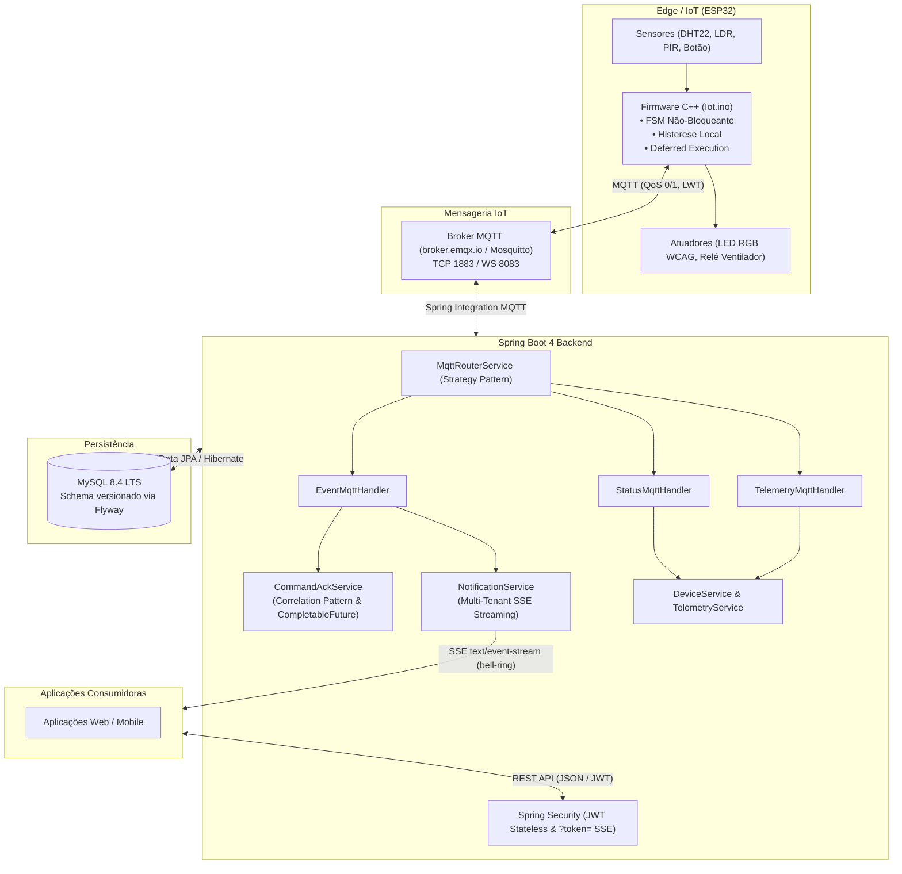

# 🏠 SmartHome IoT Backend — Sistema de Automação Residencial Acessível

[](https://openjdk.org/)
[](https://spring.io/projects/spring-boot)
[](https://www.mysql.com/)
[](https://mqtt.org/)
[](https://www.docker.com/)
[](https://junit.org/junit5/)
[](http://localhost:8080/swagger-ui.html)
[](https://www.w3.org/WAI/WCAG21/Understanding/three-flashes-or-below-threshold.html)

---

## 📌 Sobre o Projeto

O **SmartHome IoT Backend** é um ecossistema distribuído de automação residencial de alta resiliência, projetado com foco central em **acessibilidade para pessoas surdas e com deficiência auditiva**. 

O projeto soluciona uma vulnerabilidade crítica do dia a dia: a ineficácia de alarmes exclusivamente sonoros (como campainhas ou alertas de risco físico). Através da integração entre microcontroladores **ESP32** no *edge* e um backend robusto em **Spring Boot**, o sistema transforma estímulos auditivos em **sinalizações visuais imediatas no ambiente** e **notificações em tempo real via Server-Sent Events (SSE)**, além de realizar controle climático por histerese, monitoramento ambiental contínuo e acionamento remoto com confirmação de entrega via *Correlation Pattern*.

> 💡 **Contexto de Portfólio Pessoal:**  
> Concebido inicialmente como um trabalho acadêmico universitário, o projeto foi descontinuado pelo grupo original. Assumi o projeto integralmente como portfólio pessoal, reconstruindo e refinando a arquitetura com práticas modernas de engenharia de software de nível corporativo (Clean Architecture, Strategy Pattern, mensageria assíncrona MQTT, concorrência thread-safe com `CompletableFuture`, isolamento *multi-tenant* estrito e 190 testes automatizados).

---

## 🎯 Premissas & Diretrizes de Acessibilidade

- **Sinalização Visual Acessível:** A campainha sonora é convertida instantaneamente em um alerta luminoso no LED RGB do cômodo e propagada em milissegundos para os moradores conectados.
- **Segurança Fotossensível estrita (WCAG 2.3.1):** Tanto no firmware quanto nos metadados de streaming, a frequência de piscada do LED opera em **1.67 Hz** (3 ciclos de 300 ms aceso / 300 ms apagado), mantendo-se estritamente abaixo do limiar de risco de 3 flashes/segundo da diretriz internacional para prevenção de crises em indivíduos com epilepsia fotossensível.
- **Notificações Multimodais Enriquecidas:** Payloads de alerta contêm metadados sensoriais (`UrgencyLevel`, `SensoryChannel`, `altText`, `ttsText`), viabilizando que qualquer cliente (web, mobile, smartwatches) execute vibração háptica, síntese de voz e alto contraste.
- **Rastreabilidade e Acknowledge:** Confirmação de visualização do alerta com registro de autoria e carimbo temporal UTC (`PATCH /api/v1/events/{id}/acknowledge`), prevenindo omissão de atendimento em residências compartilhadas.

---

## 🏛️ Arquitetura do Sistema

O sistema é construído sobre uma arquitetura desacoplada e orientada a eventos:



---

## ⚡ Destaques de Engenharia & Design Patterns

### 1. Correlation Pattern em Comandos Assíncronos (REST ↔ MQTT)
Ao enviar um comando síncrono via REST (`POST /api/v1/devices/{deviceId}/commands`), o backend não retorna um falso sucesso instantâneo:
- Gera um UUID único (`correlationId`) e despacha para o tópico MQTT `devices/{id}/cmd`.
- O `CommandAckService` registra um `CompletableFuture` em um `ConcurrentHashMap` thread-safe e aguarda até **5 segundos**.
- O firmware do ESP32 executa a ação e ecoa o `correlationId` em `devices/{id}/event`.
- O `EventMqttHandler` resolve o *future*, liberando a thread HTTP com o status real da borda (`DELIVERED`, `FAILED` ou `TIMEOUT`).
- **Otimização de Recursos:** O método omite intencionalmente `@Transactional`, evitando prender conexões do pool JDBC durante a espera pelo hardware.

### 2. Strategy Pattern no Roteamento MQTT
O `MqttRouterService` desacopla completamente o canal de transporte MQTT da regra de negócio:
- Analisa o tópico dinamicamente (`MqttMessageType.fromTopic(...)`).
- Aplica guardas defensivas de payload.
- Despacha o envelope para o handler especializado (`TelemetryMqttHandler`, `EventMqttHandler`, `StatusMqttHandler`) via injeção polimórfica de dependências.

### 3. Isolamento Residencial Multi-Tenant (*Zero Data Leakage*)
- O banco de dados isola residências (`Home`), usuários (`AppUser`) e membros com papéis granulares (`ADMIN` vs `FAMILY`).
- O `deviceId` deriva do endereço MAC de fábrica (`ESP.getEfuseMac()`) e **não depende de `homeId` no firmware**. A associação do dispositivo à casa vive exclusivamente no banco de dados.
- O canal em tempo real de Server-Sent Events (`/api/v1/notifications/stream`) resolve a residência do dispositivo e dispara o alerta **exclusivamente para os moradores registrados daquela casa específica**.

### 4. Firmware ESP32 100% Não-Bloqueante & Padrão *Deferred Execution*
No arquivo [`Iot.ino`](file:///home/guest4hu/Documents/Projects/Java/SmartHome_BackEnd/Iot.ino):
- **Zero chamadas a `delay()` bloqueantes:** LEDs RGB utilizam Máquina de Estados Finitos (FSM) controlada por `millis()`.
- **Prevenção de Corrupção de Buffer:** A biblioteca `PubSubClient` usa buffer compartilhado. Publicar ACKs dentro de `mqttCallback` causa *buffer corruption*. O firmware implementa *deferred execution*: anota a intenção em variáveis globais e despacha com segurança na iteração seguinte do `loop()`.
- **Debounce & Cooldown de Sensores:** 50 ms de debounce mecânico no botão da campainha e 30 segundos de cooldown no sensor PIR para evitar *flooding* no broker.
- **Histerese e Override Manual de 15 minutos:** Controle térmico local autônomo (liga ventilação acima de 28 °C, desliga abaixo de 26 °C) com respeito a acionamentos manuais remotos.

### 5. Resiliência de Conexões e Monitoramento de Nós Inativos
- **Last Will and Testament (LWT):** Mensagem retida pelo broker comutando o status para `OFFLINE` em caso de desconexão abrupta do ESP32.
- **Detector de Nós Stale:** Varredura agendada a cada 60 segundos comutando dispositivos sem telemetria há mais de 3 minutos para `OFFLINE` e notificando moradores via SSE.
- **Resiliência SSE:** Heartbeat a cada 25 segundos (`:keep-alive\n\n`) para impedir encerramento precoce de conexão por firewalls e *reverse proxies*.
- **Push Notifications (FCM):** Serviço integrado com suporte nativo a modo Mock/Dry-Run automático (permitindo testes e execução local sem bloqueio por credenciais de nuvem).

---

## 📡 Topologia de Mensageria MQTT

O broker adotado para desenvolvimento/protótipo é o **`broker.emqx.io`** (porta 1883 TCP), com tópicos padronizados:

| Tópico | Direção | QoS | Retained | Descrição / Payload de Exemplo |
|---|---|---|---|---|
| `devices/{deviceId}/telemetry` | ESP32 → Backend | 0 | Não | `{"v":1,"deviceId":"esp32-...","temperature":26.5,"humidity":60.0,"luminosity":450}` |
| `devices/{deviceId}/event` | ESP32 → Backend | 1 | Não | **Físico:** `{"v":1,"deviceId":"...","type":"DOORBELL"}`<br>**ACK:** `{"v":1,"deviceId":"...","type":"COMMAND_SUCCESS","status":"DELIVERED","action":"FAN_ON","correlationId":"uuid"}` |
| `devices/{deviceId}/status` | ESP32 → Backend | 1 | **Sim** | `ONLINE` (ao conectar) / `OFFLINE` (LWT na desconexão súbita) |
| `devices/{deviceId}/cmd` | Backend → ESP32 | 1 | Não | `{"action":"FAN_ON","correlationId":"a1b2c3d4-..."}` |
| `devices/{deviceId}/config` | Backend → ESP32 | 1 | **Sim** | `{"v":1,"fanOnAbove":28.0,"fanOffBelow":26.0,"bellR":255,"bellG":0,"bellB":0}` |

---

## 🔌 Referência da API REST (v1)

A API segue padrões RESTful rigorosos, utilizando Java Records imutáveis para DTOs, autenticação stateless via JWT e formatação estrita de datas em UTC (ISO-8601).

### Autenticação & Usuários
- `POST /api/v1/auth/register` — Cadastro de usuário.
- `POST /api/v1/auth/login` — Autenticação e emissão de JWT (24h de validade).

### Gestão Residencial & Moradores
- `GET /api/v1/homes` — Lista residências do usuário logado.
- `POST /api/v1/homes` — Cria nova residência (criador torna-se `ADMIN`).
- `GET /api/v1/homes/{homeId}/members` — Lista moradores da residência.
- `POST /api/v1/homes/{homeId}/members` — Convidar morador pelo e-mail com papel `FAMILY` (Restrito a `ADMIN`).

### Dispositivos & Comandos de Hardware
- `GET /api/v1/homes/{homeId}/devices` — Lista dispositivos da residência.
- `POST /api/v1/homes/{homeId}/devices` — Registra novo dispositivo via `externalId` (Restrito a `ADMIN`).
- `POST /api/v1/devices/{deviceId}/commands` — Envia comando ao hardware e **aguarda ACK de borda** (ações: `TURN_ON`, `TURN_OFF`, `BLINK_LED`).
- `POST /api/v1/devices/active` — Heartbeat manual via REST comutando status para `ONLINE`.

### Parâmetros de Automação & Cor RGB
- `GET /api/v1/devices/{deviceId}/config` — Consulta limiares de temperatura e cor RGB do alerta da campainha.
- `PUT /api/v1/devices/{deviceId}/config` — Altera histerese (`fanOnAbove > fanOffBelow`) e componentes de cor `bellR`, `bellG`, `bellB` (0–255). Propaga imediatamente via MQTT retido com QoS 1 (Restrito a `ADMIN`).

### Telemetria & Séries Temporais Analíticas
- `POST /api/v1/telemetry` — Ingestão de telemetria em formato longo (sensores).
- `GET /api/v1/devices/{deviceId}/metrics` — Lista métricas disponíveis (`TEMPERATURE`, `HUMIDITY`, `LUMINOSITY`).
- `GET /api/v1/devices/{deviceId}/metrics/{metric}` — Séries históricas com agregação matemática automática (`RAW` para ≤24h, `HOUR` para ≤7 dias, `DAY` para períodos maiores).

### Eventos & Confirmação de Leitura
- `POST /api/v1/events` — Registro de evento pontual.
- `GET /api/v1/homes/{homeId}/events?pendingOnly=true` — Histórico de ocorrências da casa com filtro de pendências.
- `PATCH /api/v1/events/{id}/acknowledge` — Confirmação de visualização do alerta acessível.

### Streaming em Tempo Real (SSE) & Push Tokens
- `GET /api/v1/notifications/stream` — Conexão HTTP persistente (`text/event-stream`). Suporta autenticação tanto via header `Authorization: Bearer <token>` quanto via query param `?token=<jwt>` (para compatibilidade com `EventSource` nativo do navegador).
- `POST /api/v1/notifications/push-tokens` — Registro idempotente de push token para notificações móveis (FCM).
- `DELETE /api/v1/notifications/push-tokens/{token}` — Revogação de push token.

---

## 🛠️ Tecnologias Utilizadas

| Camada / Função | Tecnologia |
|---|---|
| **Linguagem & Plataforma** | Java 21 / 25 LTS |
| **Framework Base** | Spring Boot 4.1.1 (Web MVC, Data JPA, Validation, Integration, Actuator) |
| **Segurança** | Spring Security + JJWT 0.12.5 (HMAC-SHA256, Stateless) + BCrypt |
| **Mensageria IoT** | Spring Integration MQTT + Eclipse Paho Client 1.2.5 |
| **Streaming Real-Time** | Server-Sent Events (SSE) via Spring `SseEmitter` |
| **Banco de Dados** | MySQL 8.4 LTS (executado via Docker) |
| **Migrações de Schema** | Flyway Migration (`flyway-mysql`) com 6 scripts versionados |
| **Documentação Viva** | Springdoc OpenAPI 3 (Swagger UI 2.8.4) |
| **Microcontrolador / IoT Edge** | ESP32 (Framework Arduino/C++ no Wokwi ou hardware físico) |
| **Testes Automatizados** | JUnit 5 + Mockito (190 testes automatizados) |
| **Produtividade & Utilitários** | Project Lombok, Jackson Databind com `JavaTimeModule` |

---

## 🚀 Como Executar o Projeto

### Pré-requisitos
- **Java JDK 21+** instalado (ex: Eclipse Temurin ou OpenJDK).
- **Docker** e **Docker Compose** instalados e em execução.
- **Git** para clonar o repositório.

### 1. Clonar o Repositório
```bash
git clone https://github.com/Gustavo-4hu/SmartHome_BackEnd.git
cd SmartHome_BackEnd
```

### 2. Subir o Banco de Dados com Docker
O projeto conta com um arquivo `docker-compose.yaml` pré-configurado para o MySQL 8.4 LTS:

```bash
docker compose up -d
```
> O container iniciará na porta `3306` com as credenciais `smarthome:smarthome` e criará o banco `smarthome`.

### 3. Executar o Backend
Execute a aplicação utilizando o wrapper Maven incluído:

```bash
./mvnw spring-boot:run
```

Ao iniciar, o **Flyway** aplicará automaticamente as migrações de banco (incluindo o usuário e casa de teste dev).

### 4. Acessar a Documentação Interativa (Swagger)
Abra o navegador em:
```
http://localhost:8080/swagger-ui.html
```
- Você pode criar um novo usuário via `POST /api/v1/auth/register` ou autenticar via `POST /api/v1/auth/login`.
- Insira o token gerado no botão **Authorize** (topo superior direito) no formato `Bearer <seu-token>`.

---

## 📟 Simulação e Integração com o Hardware (ESP32)

O código completo do firmware encontra-se no arquivo [`Iot.ino`](file:///home/guest4hu/Documents/Projects/Java/SmartHome_BackEnd/Iot.ino).

### Pinagem de Referência no ESP32:
| Componente | Pino ESP32 | Modo | Função |
|---|---|---|---|
| **Botão da Campainha** | `GPIO 13` | `INPUT_PULLUP` | Disparo do evento `DOORBELL` e acionamento visual |
| **Sensor PIR** | `GPIO 14` | `INPUT` | Detecção de presença com cooldown de 30s |
| **Sensor DHT22** | `GPIO 27` | `INPUT` | Leitura de temperatura e umidade a cada 5s |
| **Sensor LDR** | `GPIO 34` | `INPUT (ADC)` | Medição analógica de luminosidade ambiente |
| **LED RGB - Canal R** | `GPIO 25` | `OUTPUT (PWM)` | Canal vermelho (alerta visual da campainha) |
| **LED RGB - Canal G** | `GPIO 26` | `OUTPUT (PWM)` | Canal verde (status operacional normal) |
| **LED RGB - Canal B** | `GPIO 4` | `OUTPUT (PWM)` | Canal azul (indicação de ventilador ativo) |
| **Relé do Ventilador** | `GPIO 32` | `OUTPUT` | Acionamento físico do sistema de ventilação |

### Testando no Simulador Wokwi:
1. Abra um projeto ESP32 no [Wokwi](https://wokwi.com/).
2. Cole o código de [`Iot.ino`](file:///home/guest4hu/Documents/Projects/Java/SmartHome_BackEnd/Iot.ino).
3. Conecte à rede virtual `Wokwi-GUEST`.
4. Ao iniciar a simulação, observe no console serial o `Device ID` gerado (ex: `esp32-100100C40A24`).
5. Cadastre esse dispositivo em uma residência via API REST (`POST /api/v1/homes/{homeId}/devices`).
6. A partir desse momento, as telemetrias serão gravadas no MySQL a cada 5 segundos e os comandos enviados pelo backend serão executados com confirmação síncrona.

---

## 🧪 Testes Automatizados & Qualidade de Código

A aplicação possui uma suíte abrangente de testes unitários e de integração de serviços com **100% de aprovação**:

```bash
./mvnw test
```

```
[INFO] Results:
[INFO] Tests run: 190, Failures: 0, Errors: 0, Skipped: 0
[INFO] ------------------------------------------------------------------------
[INFO] BUILD SUCCESS
[INFO] ------------------------------------------------------------------------
```

### Cenários Cobertos:
- **Correlation Pattern & Concorrência:** Validação de timeouts, recebimento de ACKs corretos, rejeição de ACKs cruzados entre dispositivos e liberação de threads bloqueadas.
- **Isolamento Residencial:** Garantia de que moradores da Casa A não recebem notificações ou acessam dispositivos da Casa B.
- **Segurança & Filtros:** Verificação de autenticação JWT, integridade de tokens, extração de claims e autorização do query param `?token=` estritamente na rota SSE.
- **Roteamento MQTT:** Teste de guardas defensivas, desserialização de JSON corrompido, e delegação para handlers via Strategy Pattern.
- **Lógica Climática & Histerese:** Validação de constraints de negócio (`fanOnAbove > fanOffBelow`), faixas físicas e consistência de valores RGB.

---

## 👤 Autor

Desenvolvido por **Gustavo** como projeto de portfólio de engenharia de software e IoT.

- **GitHub:** [@Gustavo-4hu](https://github.com/Gustavo-4hu)
- **Repositório do Projeto:** [SmartHome_BackEnd](https://github.com/Gustavo-4hu/SmartHome_BackEnd)

---
*Este projeto demonstra a aplicação prática de padrões arquiteturais corporativos, sistemas orientados a eventos, computação no edge (IoT) e compromisso ético com a acessibilidade universal.*
